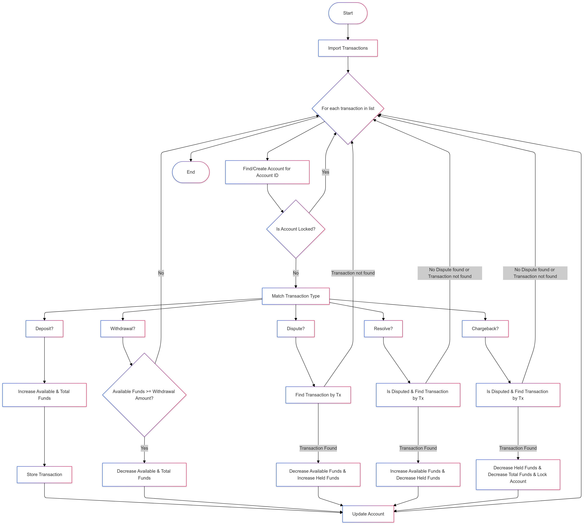

# Description

Payments engine which reads a series of transactions from a CSV and produces the state of client accounts as a CSV.

## Error handling

The current implementation of input parsing and deserialization into structs lacks robust error handling. As a result, any malformed or invalid input data could lead to an unrecoverable application failure.

## Scaling / Concurrency

The current implementation relys on a single client account transactions being processed by the same ledger.

Thoughts around scaling:

- The solution could be scaled using some sort hashing algo for example (modulo-based hashing). This could be done outside of the service in which the split would ensure a node processes the same set of client accounts. Further to this the transactions that a single node recieves could be split across many workers using tokio spawn utilizing the client id e.g. worker_index = client_id % num_workers.

## Notes

- Currently using hashmap for managing the state of accounts, deposits and disputes. It may have been a good idea to abstract the in memory data stores to a repository with a common interface that would have allowed swapping the hashmap with a database integration without having to change the ledger implementation at a later date.

## Ledger Flow Diagram

